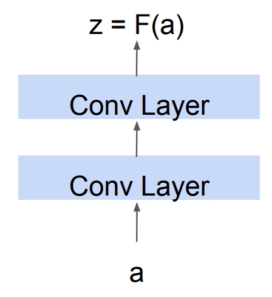

<div align="center">

**Cornell CS 4/5782**

**Spring 2025**

</div>

---

Insert overview blurb

### Network Depth

Talk about how deeper networks are not always better

### GoogLeNet/Inception Net

Mention image net classification challenge, talk about google net and the inception module

#### Inception Module

Alternatively have a subheading deep dive into the inception module and how it does dim red

#### ResNet

## ResNet (Residual Network)


ResNet, or **Residual Network**, is a type of deep neural network architecture introduced by **Kaiming He et al.** in 2015. It was designed to address the **vanishing gradient problem** in very deep networks by introducing **skip connections** (also called **residual connections**).

---

### Important Note

From here on out, this is what we will be abstracting a convolutional layer to be this:


---

### Key Idea

The main innovation of ResNet is the **residual block**, where the input is passed directly to a deeper layer, skipping one or more layers in between.

This allows gradients to flow more easily during backpropagation, enabling **very deep networks** (e.g., ResNet-50, ResNet-101, ResNet-152).

---

### What is a Residual Block?

A **residual block** is the core component of a ResNet (Residual Network). It enables the training of **very deep neural networks** by allowing information (and gradients) to **flow directly across layers** via **skip connections**.

---

#### Structure of a Residual Block

A basic residual block consists of:

1. **Two convolutional layers** .
2. A **skip connection** that bypasses these layers and adds the input directly to the output.

### Residual Connections and the Vanishing Gradient Problem

In a regular deep neural network, each layer transforms its input into an output, often written as:

# $$ z = F(a) $$



Where:

- $a$ is the input (activation from the previous layer),
- $F(a)$ is the output after applying transformations like convolution, batch normalization, and ReLU.

In **residual networks**, this changes to:

# $$z = F(a) + a$$


This is called a **skip connection** or **residual connection**, because it "skips over" the function `F` and adds the original input `a` directly to the output.

---

### Why This Helps with the Vanishing Gradient Problem

#### The Vanishing Gradient Problem

When training very deep networks, gradients (which are used to update weights via backpropagation) can become **very small** as they pass backward through many layers. This causes earlier layers to train very slowly — or not at all.

In mathematical terms, if you keep multiplying small derivatives (like < 1) across dozens or hundreds of layers, the final product (gradient) can approach zero:

$$
\frac{∂L}{∂w} = \frac{∂L}{∂z_n} \times \frac{∂z_n}{∂z_{n-1}} \times \cdots \times \frac{∂z_2}{∂z_1} \times \frac{∂z_1}{∂w}
$$

#### How Resnets solve this

With residual connections, each layer's output is $z = F(a) + a$, so during backpropagation, the gradient becomes:

$$ \frac{∂L}{∂a} = \frac{∂L}{∂z} \times \left( \frac{∂F(a)}{∂a} + I \right) $$

Where $I$ is the identity matrix from the derivative of $a$ (since $∂(a)/∂a = I$).

This means that even if the gradient of $F(a)$ vanishes (i.e., becomes very small), the presence of the **identity term** ensures that **some gradient always flows through**:

- The shortcut path ensures **direct gradient flow** from later layers back to earlier layers.
- This helps **preserve gradient magnitude**, preventing them from vanishing.
- As a result, **deep networks can be trained effectively** without performance degradation.

---

### Summary

- Regular block: $z = F(a)$ → gradients can vanish.
- Residual block: $z = F(a) + a$ → gradients include both $∂F(a)$ and the identity path.
- Skip connections create **highway routes** for gradient flow.
- This enables the successful training of networks with **50, 100, or even 1000+ layers**.

# Stochastic Depth

> *“Can we train *very* deep ResNets without paying the full computational cost at every iteration?”*  
> **Stochastic depth** answers _yes_ by **randomly dropping entire residual blocks during training** — making the network shallower on‑the‑fly, yet keeping its full depth at inference.

---

### 1  Why Do We Need Stochastic Depth?

| Challenge in Very‑Deep Nets                     | Consequence                      |
| ----------------------------------------------- | -------------------------------- |
| Longer forward pass                             | Slower training iterations       |
| Longer backward pass                            | Smaller batch sizes (GPU memory) |
| Vanishing/exploding gradients (even with skips) | Optimization difficulty          |

**Insight:** We _already_ know ResNets work because the identity skip path lets the network behave like an ensemble of shallower sub‑networks.  
_So why not explicitly **train** an ensemble of these shallower nets?_

---

### 2  High‑Level Idea

1. **During training** each residual block is **dropped** (skipped) with probability $p_l$, where $l$ is the index of the residual block.
2. **During inference** _all_ blocks are kept (i.e.\ the **full depth** is used).
3. To keep the expected activations consistent, we **scale** surviving blocks.

---

### 3  Notation

Let’s recall the basic structure of a residual block. As discussed earlier:

$$
z = F(a) + a
$$

Where:

- $a$ is the input to the block (activation from the previous layer)
- $F(a)$ is a sequence of operations (e.g., convolution → batch norm → ReLU)
- $z$ is the output of the block
- $F$ contains learnable parameters $\\theta$

In **stochastic depth**, we introduce a **random binary variable** We define a random binary variable:

$$
b \sim \text{Bernoulli}(1 - p)
$$

that determines whether to apply the residual function \( F(a) \) or skip it entirely during **training**.

So during training, the residual block becomes:

$$
z =
\begin{cases}
F(a) + a & \text{if } b = 1 \quad \text{(block kept)} \\[6pt]
a & \text{if } b = 0 \quad \text{(block dropped)}
\end{cases}
$$

Where:

- $p \in [0, 1]$ is the **drop probability**,
- $b \sim \text{Bernoulli}(1 - p)$ controls whether the block is **active** in this forward pass.

During **inference**, we use all blocks but scale the residual output by the **expected survival rate** $(1 - p)$ to match training statistics:

$$
z = (1 - p) \cdot F(a) + a
$$

This ensures that the **expected output** of the block is consistent between training and test time.

### 4  Stochastic Depth Formulation

#### 4.1  Probability Scheduling

A common way to define the drop probability $p$ for each layer is to make it **increase linearly with depth**. For a network with $L$ residual blocks, the drop probability for the $l^{\text{th}}$ block is:

$$
p_l = \frac{l}{L} \cdot p_{\text{max}}
$$

where:

- $p_{\text{max}}$ is the **maximum** drop probability at the final layer (e.g. 0.5),
- $l$ is the block index (starting from 1).

This means **early layers are kept more often**, and **deeper layers are dropped more often** during training — which aligns well with how gradients behave in deep networks.

---

#### 4.2  Scaling for Inference

During **inference**, all blocks are used. To maintain consistency with training-time activations, we scale the residual output by the **expected keep probability** \( 1 - p \):

$$
z = (1 - p) \cdot F(a) + a
\tag{2}
$$

This ensures that the **expected value of the output** matches what the model saw during training.

---

### 5  Backpropagation Sketch

In stochastic depth, **only the residual blocks that are kept (i.e., not dropped)** contribute to the gradient during training.

Let:

- $a$ be the input to the residual block,
- $F(a; w)$ be the residual function — a learnable transformation applied to $a$, parameterized by weights $w$,
- $z = F(a; w) + a$ be the output when the block is kept,
- $b \sim \text{Bernoulli}(1 - p)$ be the binary variable that determines whether the block is used,
- $w$ be the weights of the residual function $F(a)$.

Then the gradient of the loss with respect to the block’s parameters is:

$$
\frac{\partial L}{\partial w} =
\begin{cases}
\frac{\partial L}{\partial z} \cdot \frac{\partial F(a; w)}{\partial w}, & b = 1 \quad \text{(block kept)} \\[6pt]
0, & b = 0 \quad \text{(block dropped)}
\end{cases}
$$

Only the active blocks receive gradients and are updated. As a result, each training batch effectively updates a **random sub-network** — acting like a built-in **model ensemble** and a form of **strong regularization**.

---

### 6  Intuition & Analogy

| Technique            | Drops _what_?         | Purpose                                                  |
| -------------------- | --------------------- | -------------------------------------------------------- |
| **Dropout**          | Individual neurons    | Prevent co‑adaptation                                    |
| **Stochastic Depth** | Whole residual blocks | Reduce depth **per iteration** and act as model ensemble |

> Think of it as **“Drop‑ResBlocks”** instead of “Drop‑Neurons”.

---

### 7  Practical Impact

- **Faster training** — fewer blocks $\Rightarrow$ shorter forward/backward pass per iteration.
- **Better generalization** — acts like averaging an exponential number of shallower ResNets.
- **Ease of implementation** — only a few lines in popular DL libraries.

---

# DenseNet


> _“What if, instead of **adding** features like in ResNets, we simply **concatenate** them so every layer has direct access to all earlier information?”_  
> **DenseNets** answer _yes_ by **densely connecting** each layer to **every other** layer in a feed-forward fashion, dramatically improving information and gradient flow.

---

### 1 Why Do We Need DenseNets?

| Challenge in Very‑Deep Nets                     | Consequence                            |
| ----------------------------------------------- | -------------------------------------- |
| Vanishing/exploding gradients (even with skips) | Optimization difficulty                |
| Feature reuse is limited                        | Redundant parameters, bigger models    |
| Parameter growth vs. depth                      | Deeper nets often become memory-hungry |

**Insight:** If each layer could **see** all earlier feature maps, it could **reuse** them instead of relearning similar filters, while gradients would flow through many **short paths**.

---

### 2 High-Level Idea

1. **Dense Connectivity:** In a DenseNet, each layer $l$ receives as input the **concatenation** of the feature maps produced by **all preceding layers**:

$$
a_l = [z_0, z_1, \dots, z_{l-1}]
$$

where:

- $z_i$ is the output (feature map) of the $i^\text{th}$ layer
- $a_l$ is the input to the $l^\text{th}$ layer
- $[\,\cdot\,]$ denotes **concatenation along the channel dimension**

This structure allows each layer to directly access the features learned by all previous layers, promoting **feature reuse** and improving **gradient flow**.

2. **Composite function:** Each layer applies a transformation:

   $$
   z_l = H_l(a_l)
   $$

   where $H_l$ is typically **BatchNorm → ReLU → 3×3 Conv**.

3. **Linear growth:** The number of new feature maps added at each layer is a small **growth rate** $k$.

---

### 3 Notation

- $z_0$: initial input (e.g., output of a stem convolution layer)
- $a_l$: concatenated input to layer $l$
- $H_l(\cdot)$: composite function of layer $l$ with weights $w_l$
- $z_l$: output feature maps of layer $l$
- $k$: growth rate (number of new feature maps each layer adds)

A dense block with $L$ layers generates:

$$
a_{l+1} = [a_l, z_l] \quad \text{for } l = 0, \dots, L-1
$$

The total number of feature maps after the block is approximately:

$$
\text{Channels} = \text{input channels} + k \cdot L
$$

---

### 4 Dense Block Formulation

Inside a dense block:

$$
z_l = H_l(a_l; w_l), \qquad a_{l+1} = [a_l, z_l]
$$

Because DenseNets use **concatenation** instead of addition, feature dimensionality grows with depth.  
To prevent memory from growing unboundedly, **transition layers** are added between dense blocks:

$$
\text{Transition: BN → 1×1 Conv → AvgPool}
$$

The 1×1 convolution acts as a compression step, reducing the number of channels.  
This is often done with a compression factor $\theta_{\text{comp}} \in (0, 1]$.

---

### 5 Backpropagation Sketch

Gradients flow through **multiple direct paths** due to concatenation:

1. **Local path**: layer $l$ contributes to $z_l$ via $w_l$
2. **Shortcut paths**: since $z_l$ appears in $a_m$ for all $m > l$, its gradient includes contributions from all later layers.

Gradient with respect to weights $w_l$:

$$
\frac{\partial L}{\partial w_l} = \frac{\partial L}{\partial z_l} \cdot \frac{\partial H_l(a_l;\, w_l)}{\partial w_l}
$$

Gradient of $z_l$ accumulates contributions from every future layer that uses it:

$$
\frac{\partial L}{\partial z_l} =
\sum_{m = l+1}^{L}
\frac{\partial L}{\partial a_m} \cdot \frac{\partial a_m}{\partial z_l}
$$

This design ensures **better gradient flow** and **deep supervision**.

---

### 6 Intuition & Analogy

| Architecture | Connection Type | What Flows Easily?     | Analogy                     |
| ------------ | --------------- | ---------------------- | --------------------------- |
| ResNet       | Addition skip   | Gradient magnitude     | "Highway" for gradients     |
| DenseNet     | Concatenation   | Gradients and features | "Bus route with many stops" |

> DenseNets behave like **feature reuse engines**, where each layer adds only new, complementary information.

---

### 7 Practical Impact

- **Parameter-efficient**: fewer total weights compared to ResNets of similar accuracy
- **Strong regularization**: encourages feature reuse and reduces overfitting
- **Improved gradient flow**: multiple short paths to output
- **Memory considerations**: more feature maps → use compression and checkpointing

---

### 8 Reference

Gao Huang, Zhuang Liu, Laurens van der Maaten, Kilian Q. Weinberger  
**Densely Connected Convolutional Networks**  
_CVPR 2017_  
<https://arxiv.org/abs/1608.06993>

### Summary of models

Go over plain CNN, google Net, ResNet and aDenseNet

```

```
